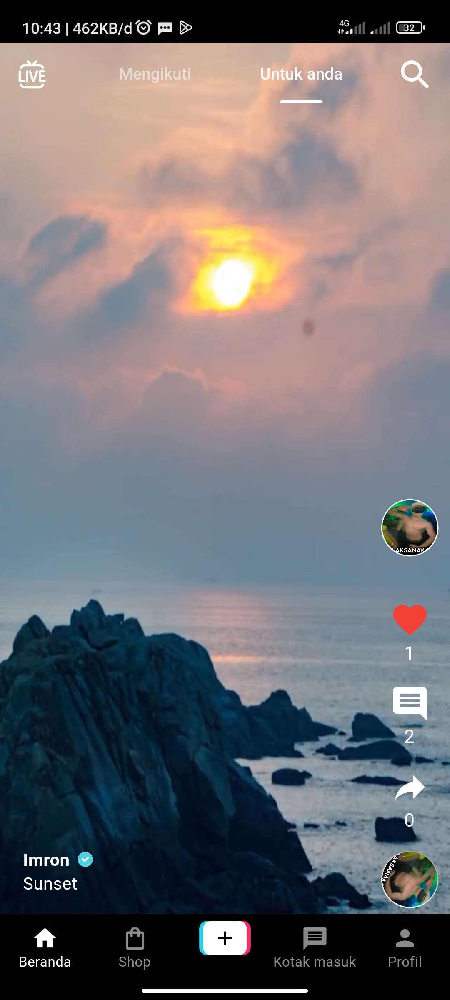
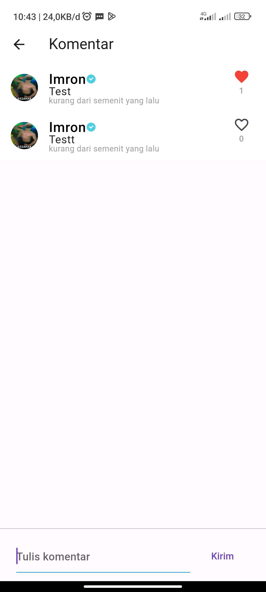
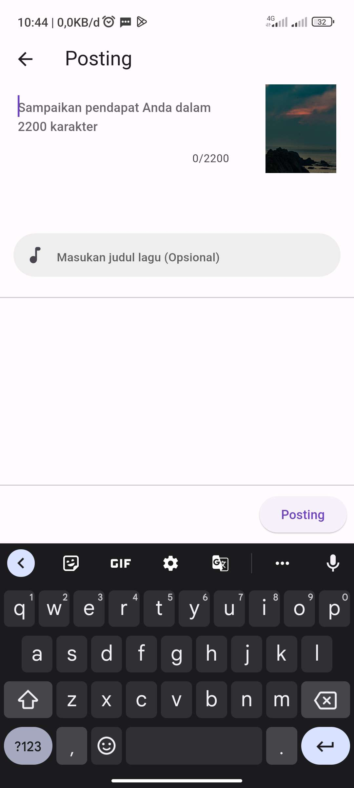
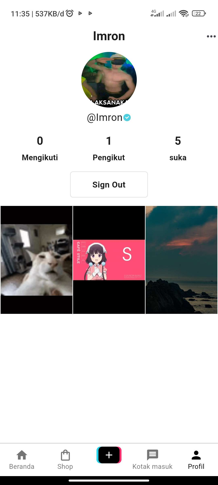
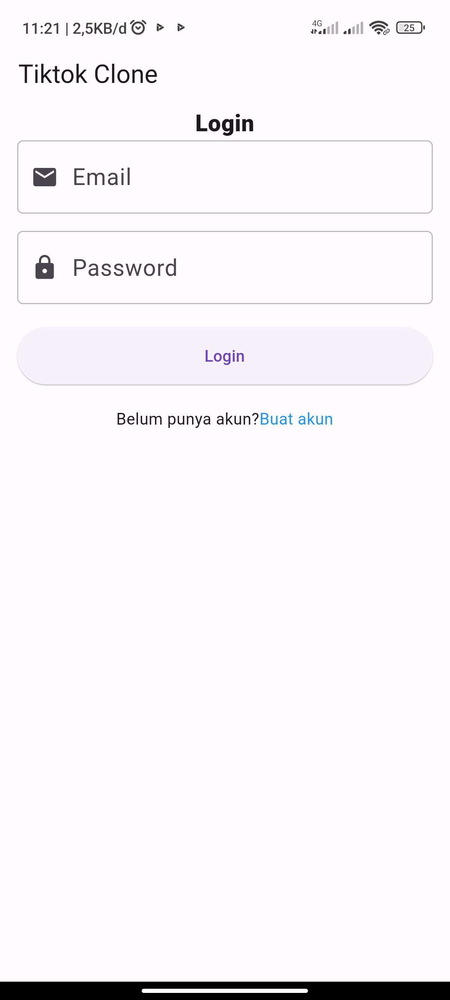

# Fullstack TikTok Clone Flutter Firebase

TikTok Clone using Flutter as a front-end and Firebase as a back-end

## Screenshots

## Features

- Login system.
- Post videos, like videos, comment videos.
- Follow and unfollow.
- Follower, following and likes counter.
- Profile photo update.

## Dependencies
- firebase_core: ^2.13.0
- firebase_storage: ^11.2.1
- firebase_auth: ^4.6.1
- image_picker: ^0.8.7+5
- video_player: ^2.6.1
- video_compress: 3.1.1
- intl: ^0.18.1
- timeago: ^3.4.0
- cached_network_image: ^3.2.3

## Download APK
[Download](https://drive.google.com/file/d/16rJyINF-qhsuUC-pjZe6MbBjk0hISKIH/view?usp=drive_link)

